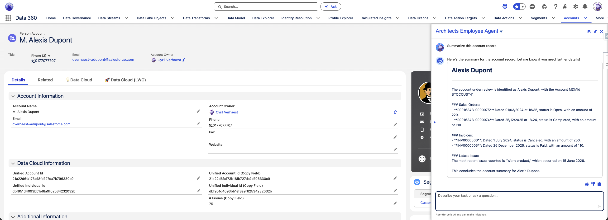
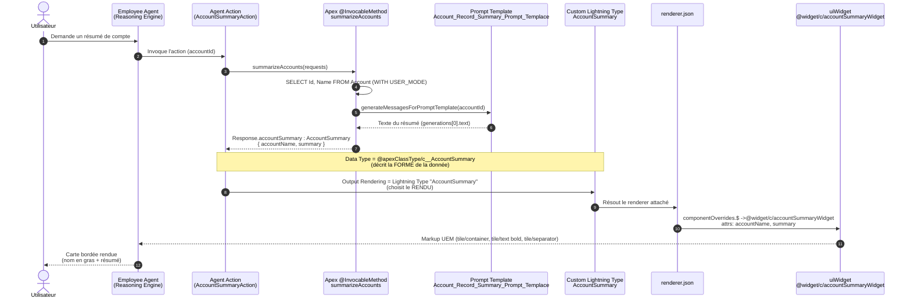

# Rendu d'un widget HXL dans une conversation Agentforce

Résumé du flux qui permet à l'action `AccountSummaryAction` de rendre son résultat
sous forme de **carte HXL** (nom du compte en gras + séparateur + corps du résumé),
au lieu d'une simple narration texte.

## Illustration



La carte HXL s'affiche dans le panneau **Architects Employee Agent** (à droite de la
page Data 360) : titre "Alexis Dupont" en gras, séparateur horizontal, puis le corps
du résumé généré par le prompt template.

## Diagramme de séquence



## Point clé (root cause)

Le rendu ne fonctionnait pas tant que le champ **Output Rendering** de l'agent action
pointait sur le **type Apex brut** `@apexClassType/c__AccountSummary`, qui **n'a aucun
renderer attaché** → le reasoning engine retombait sur la **narration texte** (markdown
`**` littéral, phrases ajoutées type « Let me know… »).

La correction : sélectionner explicitement le **Custom Lightning Type `AccountSummary`**
(le bundle `lightningTypes/AccountSummary/`) dans **Output Rendering**. Ce bundle porte
le `renderer.json` qui redirige vers le widget `@widget/c/accountSummaryWidget`.

| Champ de l'action | Valeur | Rôle |
|---|---|---|
| **Data Type** | `@apexClassType/c__AccountSummary` | Décrit la **forme** de la donnée |
| **Output Rendering** | `AccountSummary` (Lightning Type bundle) | Choisit le **rendu** (porte le renderer) |

> Mnémotechnique : **le Data Type décrit la donnée, l'Output Rendering choisit le rendu.**

## Chaîne d'artefacts

```
AccountSummary.cls (DTO @AuraEnabled: accountName, summary)
        ↓  backing type
@apexClassType/c__AccountSummary
        ↓  lightning:type
lightningTypes/AccountSummary/schema.json  +  renderer.json
        ↓  componentOverrides
@widget/c/accountSummaryWidget
        ↓  attributs mappés
uiWidgets/accountSummaryWidget (schema.json + accountSummaryWidget.json)
```

## Notes

- La décision de rendu vit **côté org** (config de l'agent action), pas dans les
  fichiers locaux du projet — c'est pourquoi republier/réactiver une version ne
  changeait rien tant que l'Output Rendering n'était pas corrigé.
- Le corps `summary` est un blob texte issu du prompt template ; le structurer
  (ex. sous-cartes Sales Orders / Invoices) nécessiterait de renvoyer des données
  structurées (liste d'objets) et d'enrichir le widget en conséquence.
- Surface de rendu : la carte HXL s'affiche dans les surfaces qui supportent le
  rendu des widgets Agentforce.
```
