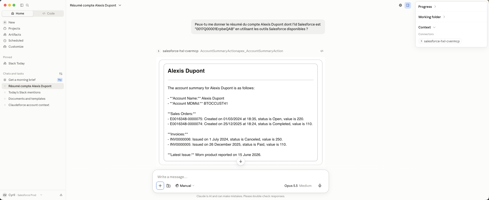
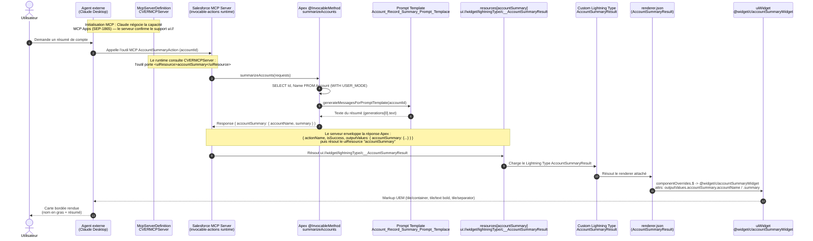

# Rendu d'un widget HXL dans une conversation d'agent externe (Claude Desktop)

Résumé du flux qui permet à l'action `AccountSummaryAction`, appelée depuis un **agent
externe** (ex. Claude Desktop via le serveur MCP `CVERMCPServer`), de rendre son
résultat sous forme de **carte HXL** — même rendu visuel qu'en conversation Agentforce,
mais le chemin d'assemblage est différent.

## Standard sous-jacent : MCP Apps (SEP-1865)

Le rendu inline du widget repose sur **MCP Apps**, une extension ouverte du protocole
MCP publiée par Anthropic (SEP-1865). Ce n'est pas une spécification Salesforce
propriétaire : Anthropic l'a lancée avec une liste de partenaires (Slack, Asana, Box,
Canva, Figma, monday.com…), Salesforce figurant parmi eux.

MCP Apps ajoute au protocole MCP la capacité `ui://` :
- le **serveur** déclare des ressources UI (`ui://` templates) attachées à ses outils
- le **client** négocie cette capacité à l'initialisation et rend le contenu inline au
  lieu de retourner du texte/JSON brut

Ce que fait Salesforce, c'est **se conformer à MCP Apps côté serveur** : le
`CVERMCPServer` expose la ressource `ui://widget/lightningType/c__AccountSummaryResult`
via ce canal standard. Claude Desktop implémente MCP Apps côté client et effectue le
rendu natif.

```
MCP (protocole de base)         ← Anthropic, open standard
    ↓ extension
MCP Apps / SEP-1865             ← Anthropic, open — capacité ui://
    ↓ conformité côté serveur
Salesforce HXL                  ← ui://widget/lightningType/... + tile/* primitives
    ↓ rendu côté client
Claude Desktop                  ← implémente MCP Apps, rend inline
```

Tout client qui implémente MCP Apps peut rendre ces widgets — pas seulement Claude Desktop.

## Illustration



La carte HXL s'affiche dans **Claude Desktop** (modèle Opus 5.5) après un appel à
l'outil `AccountSummaryActionapex_AccountSummaryAction` via le connecteur
`salesforce-hxl-cvermcp` (visible dans le panneau Context à droite) : même rendu
visuel qu'en conversation Agentforce — titre "Alexis Dupont" en gras, séparateur,
corps du résumé.

## Diagramme de séquence



## Différence fondamentale avec le flux Agentforce

| | Flux Agentforce (natif) | Flux agent externe (MCP) |
|---|---|---|
| **Protocole de rendu** | Interne au Reasoning Engine | MCP Apps / SEP-1865 (standard Anthropic) |
| **Invocateur** | Reasoning Engine (Employee Agent) | Agent externe via `CVERMCPServer` |
| **Enveloppe retournée** | `AccountSummary` direct (`accountName`, `summary`) | `AccountSummaryResult` (enveloppe MCP : `actionName`, `isSuccess`, `outputValues`) |
| **Lightning Type de rendu** | `AccountSummary` | `AccountSummaryResult` |
| **Chemin attrs dans renderer.json** | `{!$attrs.accountName}` | `{!$attrs.outputValues.accountSummary.accountName}` |
| **Tag schema** | *(aucun)* | `"lightning:tags": ["mcp"]` |

Le serveur `invocable-actions` **ajoute une couche d'enveloppe** autour de la réponse
Apex — d'où la nécessité d'un Lightning Type et d'un renderer **distincts** pour le
chemin MCP.

## Rôle du McpServerDefinition (CVERMCPServer)

Le fichier `CVERMCPServer.mcpServerDefinition-meta.xml` est la **configuration côté org**
qui câble le rendu HXL pour un agent externe. Deux éléments sont essentiels :

### 1. `<uiResource>` sur le tool

```xml
<tools>
    <apiDefinition>
        <apiIdentifier>aa:apex-AccountSummaryAction</apiIdentifier>
        <apiSource>API_CATALOG</apiSource>
        <operation>AccountSummaryAction</operation>
    </apiDefinition>
    ...
    <uiResource>accountSummary</uiResource>   <!-- ← le lien vers la ressource UI -->
</tools>
```

Ce champ dit au runtime MCP : « quand cet outil retourne un résultat, utilise la
ressource UI nommée `accountSummary` pour le rendu. » Sans lui, la réponse Apex est
retournée en JSON brut et l'agent externe la transcrit en texte.

### 2. `<resources>` — la résolution vers le Lightning Type

```xml
<resources>
    <resourceName>accountSummary</resourceName>
    <resourceUri>ui://widget/lightningType/c__AccountSummaryResult</resourceUri>
    <resourceTitle>Account Summary CLT Resource</resourceTitle>
    <description>...</description>
</resources>
```

Le `resourceUri` utilise le schéma `ui://` défini par **MCP Apps (SEP-1865)** — c'est
le canal standard qu'Anthropic a ouvert pour le rendu inline. Le sous-chemin
`widget/lightningType/<nom>` est la convention Salesforce dans ce canal, qui pointe
vers le Custom Lightning Type `AccountSummaryResult`. C'est ce type qui porte le
`renderer.json` — la chaîne de rendu démarre ici.

> **Analogie avec le flux Agentforce :** le champ `Output Rendering` de l'agent action
> joue le même rôle que `<uiResource>` + `<resources>` ici — les deux désignent le
> Lightning Type à utiliser pour le rendu.

## Pourquoi deux types distincts : `AccountSummaryOutputValues` et `AccountSummaryResult`

Le serveur `invocable-actions` enveloppe systématiquement la réponse Apex dans une
**structure d'enveloppe MCP à deux niveaux** :

```
AccountSummaryResult          ← enveloppe top-level (actionName, isSuccess, outputValues)
  └─ outputValues             ← champ typé par AccountSummaryOutputValues
       └─ accountSummary      ← le DTO Apex (accountName, summary)
```

| Type | Rôle |
|---|---|
| **`AccountSummaryResult`** | Enveloppe top-level retournée par le serveur MCP. Porte le `renderer.json`. Tag `mcp` pour que le runtime la reconnaisse comme enveloppe d'outil MCP. |
| **`AccountSummaryOutputValues`** | Type intermédiaire qui décrit la forme du champ `outputValues`. Sépare la structure de l'enveloppe (`AccountSummaryResult`) de la forme de la donnée métier. Tag `mcp` également. |

Cette séparation en deux types permet de **réutiliser `AccountSummaryOutputValues`**
si plusieurs actions MCP retournaient le même `accountSummary` dans leur `outputValues`,
sans dupliquer la définition du champ.

## Point clé

Sans le type `AccountSummaryResult` (et son `renderer.json`), Claude Desktop reçoit la
réponse brute JSON de l'outil MCP et la transcrit en texte. Le type fournit la règle de
rendu qui redirige vers le widget — le résultat visuel est alors **identique** à celui
de la conversation Agentforce.

## Chaîne d'artefacts (chemin MCP)

```
AccountSummary.cls  (DTO @AuraEnabled : accountName, summary)
        ↓  backing type
@apexClassType/c__AccountSummary
        ↓  propriété dans AccountSummaryOutputValues
lightningTypes/AccountSummaryOutputValues/schema.json
        → outputValues.accountSummary : @apexClassType/c__AccountSummary
        ↓  propriété dans AccountSummaryResult
lightningTypes/AccountSummaryResult/schema.json
        → outputValues : c__accountSummaryOutputValues
        → lightning:tags: ["mcp"]        ← marque ce type comme enveloppe MCP
        ↓  renderer attaché
lightningTypes/AccountSummaryResult/renderer.json
        → componentOverrides.$ : @widget/c/accountSummaryWidget
          attrs : outputValues.accountSummary.{accountName,summary}
        ↓
uiWidgets/accountSummaryWidget/accountSummaryWidget.json
        → tile/widget > tile/container > tile/text (h2 bold) + tile/separator + tile/text (body)
```

## Comparaison des deux renderer.json

```jsonc
// AccountSummary/renderer.json  (flux Agentforce — accès direct)
{
  "componentOverrides": {
    "$": {
      "definition": "@widget/c/accountSummaryWidget",
      "attributes": {
        "accountName": "{!$attrs.accountName}",
        "summary":     "{!$attrs.summary}"
      }
    }
  }
}

// AccountSummaryResult/renderer.json  (flux MCP — enveloppe déballée)
{
  "componentOverrides": {
    "$": {
      "definition": "@widget/c/accountSummaryWidget",
      "attributes": {
        "accountName": "{!$attrs.outputValues.accountSummary.accountName}",
        "summary":     "{!$attrs.outputValues.accountSummary.summary}"
      }
    }
  }
}
```

## Notes

- Le tag `"lightning:tags": ["mcp"]` dans `AccountSummaryResult/schema.json` (et
  `AccountSummaryOutputValues/schema.json`) signale au runtime que ces types font partie
  de la surface MCP — sans ce tag, l'enveloppe n'est pas reconnue.
- Le widget `accountSummaryWidget.json` est **partagé** entre les deux chemins ; seul le
  mapping des attributs dans le renderer change.
- Surface de rendu : la carte HXL s'affiche dans tout client qui implémente **MCP Apps
  (SEP-1865)** — Claude Desktop aujourd'hui, potentiellement ChatGPT, Cursor, ou tout
  agent custom qui implémente la capacité `ui://`.
- Si le serveur MCP utilisé est `sobject-all` (CRUD/SOQL) plutôt que `CVERMCPServer`,
  il ne passe pas par ce chemin de rendu — les résultats SOQL bruts ne déclarent pas
  de `uiResource` et ne déclenchent pas les Lightning Types.
